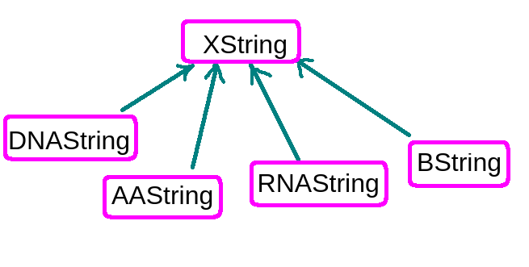

Установка пакета 
```{r, message=FALSE, warning=FALSE}
if (!requireNamespace("BiocManager", quietly = TRUE))
    install.packages("BiocManager")

BiocManager::install("Biostrings")
```

Для чего нужен?
--------------
Для работы с геномом к примеру надо достаточно быстро уметь обрабатывать большие строки, которые не помещаются в оперативную память. 

Какие типы обьектов и классов используются
-----------------------
XString - виртуальный класс, от которого наследуются все нижеперечислвенные классы




**<span style="color:fuchsia">BString</span>** - класс для хранения больших по размеру строк.

**<span style="color:fuchsia">DNAString</span>** - специальный класс предназначеный для хранения ДНК. Разрешены символы только из специального алфавита (IUPAC extended genetic alphabet) и символ пропуска (-). Каждый символ хранится специальным образом.

**<span style="color:fuchsia">RNAString</span>** - специальный класс предназначеный для хранения РНК. Разрешены символы только из специального алфавита (IUPAC extended genetic alphabet) и символ пропуска (-). Каждый символ хранится специальным образом.

**<span style="color:fuchsia">AAString</span>** - специальный класс предназначеный для хранения аминокислотных последовательностей

**<span style="color:fuchsia">XStringViews</span>** - специальный класс, контейнер для хранения срезок (views) 

Основные функции и методы 
-------------------------
```{r, message=FALSE}
library(Biostrings)
b <- BString("I am a BString object")
d <- DNAString("TTGAAAA-CTC-N")
r <- RNAString("UAA-C-A")
```
**<span style="color:green">alphabetFrequency</span>**

```{r}
alphabetFrequency(d)
```

**<span style="color:green">letterFrequency</span>**

```{r}
letterFrequency(b, c("I", "a"))
```

**<span style="color:green">consensusMatrix</span>**
```{r}
DNAMultipleAlignment(c(DNAString("TTGA"), DNAString("ATGA")), start=c(1, 5), end=c(4, 8))
```

```{r}
align <- DNAMultipleAlignment(c(DNAString("TTGA"), DNAString("ATGA")), start=c(1, 5), end=c(4, 8))
consensusMatrix(align, baseOnly=TRUE)
```
**<span style="color:green">consensusString</span>**

```{r}
consensusString(align)
```
**<span style="color:green">reverse</span>**
```{r}
reverse(d)
```
**<span style="color:green">complement</span>**
```{r}
complement(d)
```
**<span style="color:green">reverseComplement</span>**

```{r}
reverseComplement(d)
```

**<span style="color:green">translate</span>**

```{r}
translate(DNAString("AATTGGGGC"))

```


```{r}
translate(RNAString("AAUUGGGGC"))
```
**<span style="color:green">chartr</span>**
```{r}
chartr(old="AA", new="TT", x=DNAString("AAT"))

```
**<span style="color:green">replaceAmbiguities</span>**

<span style="color:red;background-color:#FFCCCC"> replaceAmbiguities()</span> is a simple wrapper around 
<span style="color:red;background-color:#FFCCCC"> chartr()</span> that replaces all IUPAC ambiguities with N
```{r}
dna <- DNAStringSet(c("TTTKYTT-GR", "", "NAASACVT"))
dna
```
```{r}
replaceAmbiguities(dna)
```

**<span style="color:green">matchPattern</span>**
```{r}
matchPattern(DNAString("A"), DNAString("TAA"))

```


**<span style="color:green">countPattern</span>**
```{r}
countPattern(DNAString("A"), DNAString("TAA"))

```
**<span style="color:green">matchPDict</span>**
```{r}
matchPDict(DNAStringSet("ACGTAG", start=c(1, 2), end=c(4, 6)), DNAString("ACGTAG"))

```
**<span style="color:green">countPDict</span>**
```{r}
countPDict(DNAStringSet("ACGTAG", start=c(1, 2, 3), end=c(4, 6, 5)), DNAString("ACGTAG"))

```

**<span style="color:green">whichPDict</span>**
```{r}
whichPDict(DNAStringSet("ACGTAG", start=c(1, 2, 3), end=c(4, 6, 5)), DNAString("ACGTAG"))

```

**<span style="color:green">pairwiseAlignment</span>**

```{r}
s1 <- 
  DNAString("ACTTCACCAGCTCCCTGGCGGTAAGTTGATCAAAGGAAACGCAAAGTTTTCAAG")
s2 <-
  DNAString("GTTTCACTACTTCCTTTCGGGTAAGTAAATATATAAATATATAAAAATATAATTTTCATC")

mat <- nucleotideSubstitutionMatrix(match = 1, mismatch = -3, baseOnly = TRUE)
mat
```
```{r}
globalAlign <- 
  pairwiseAlignment(s1, s2, substitutionMatrix = mat)

globalAlign

```
```{r}
localAlign <-
  pairwiseAlignment(s1, s2, type = "local", substitutionMatrix = mat)

localAlign
```
```{r}
overlapAlign <-
  pairwiseAlignment(DNAString("ATTT"), DNAString("TTTA"), type = "overlap", substitutionMatrix = mat)
overlapAlign
```


**<span style="color:green">matchPWM</span>**
```{r}
x <- DNAStringSet("ACAAGACTAGTCAAG", start=c(1, 6, 11), end=c(5, 10, 15))
x
```
Position Weight Matrix (PWM)
```{r}
pwm <- PWM(x, type ="prob", prior.params = c(A=0.25, C=0.25, G=0.25, T=0.25))
pwm
```
```{r}
matchPWM(pwm, "GATTTTGACACAAG", min.score=0.1)

```


```{r}
matchPWM(pwm, "GATTTTGACACAAG", min.score=0.6)

```

**<span style="color:green">countPWM</span>**

```{r}
countPWM(pwm, "GATTTTGACACAAG", min.score=0.6)
```

**<span style="color:green">trimLRPatterns </span>**
```{r}
trimLRPatterns(Lpattern = "A", Rpattern = "G", "AAGG")
```

**<span style="color:green">matchLRPatterns </span>**

```{r}
matchLRPatterns(Lpattern="AAC", Rpattern = "G", max.gaplength = 1, DNAString("ATAACTGC"))

```
```{r}
matchLRPatterns(Lpattern="AAC", Rpattern = "G", max.gaplength = 0, DNAString("ATAACTGC"))

```

**<span style="color:green">matchProbePair</span>**
```{r}
matchProbePair(Fprobe="AA", Rprobe="TG", subject=DNAString("AACA"))
```
```{r}
matchProbePair(Fprobe="AA", Rprobe="CA", subject=DNAString("AATG"))
```


Небольшой пример запуска
------------------------

```{r, message=FALSE, warning=FALSE}
library(Biostrings)
origMAlign <-
  readDNAMultipleAlignment(filepath =
                           system.file("extdata",
                                       "msx2_mRNA.aln",
                                       package="Biostrings"),
                           format="clustal")

phylipMAlign <-
  readAAMultipleAlignment(filepath =
                          system.file("extdata",
                                      "Phylip.txt",
                                      package="Biostrings"),
                          format="phylip")

```

```{r}
system.file("extdata", "Phylip.txt", package="Biostrings")
```

```{r}
origMAlign
```

```{r}
phylipMAlign
```

```{r}
rownames(origMAlign) <- c("Human","Chimp","Cow","Mouse","Rat",
                          "Dog","Chicken","Salmon")
origMAlign
```

**<span style="color:green">rowmask / colmask</span>**

```{r}
rowmask(origMAlign)
```

```{r}
maskTest <- origMAlign
rowmask(maskTest) <- IRanges(start=1,end=3)
rowmask(maskTest)
maskTest
```

```{r}
colmask(maskTest) <- IRanges(start=c(2,5),end=c(3,6))
colmask(maskTest)
maskTest
```


```{r}
rowmask(maskTest) <- NULL
colmask(maskTest) <- NULL
maskTest
```

```{r}
rowmask(maskTest, invert=TRUE) <- IRanges(start=4,end=8)
colmask(maskTest, invert=TRUE) <- IRanges(start=2,end=999)
maskTest

```

```{r}
colmask(maskTest) <- NULL
rowmask(maskTest) <- NULL
```

```{r}
tataMasked <- maskMotif(origMAlign, "TATA")

tataColMask <- colmask(tataMasked)
tataColMask
```


```{r}
autoMasked <- maskGaps(origMAlign, min.fraction=0.85, min.block.width=4)
autoMasked

```
```{r}
alphabetFrequency(autoMasked)
```

```{r}
consensusMatrix(autoMasked, baseOnly=TRUE)[,84:90]
```
```{r}
substr(consensusString(autoMasked),80,130)
```

```{r}
alphabetFrequency(autoMasked)
```

```{r}
sdist <- stringDist(as(origMAlign,"DNAStringSet"), method="hamming")
clust <- hclust(sdist, method = "single")

plot(clust)

```


```{r}
sdist <- stringDist(as(phylipMAlign,"AAStringSet"), method="hamming")
clust <- hclust(sdist, method = "single")

plot(clust)

```


